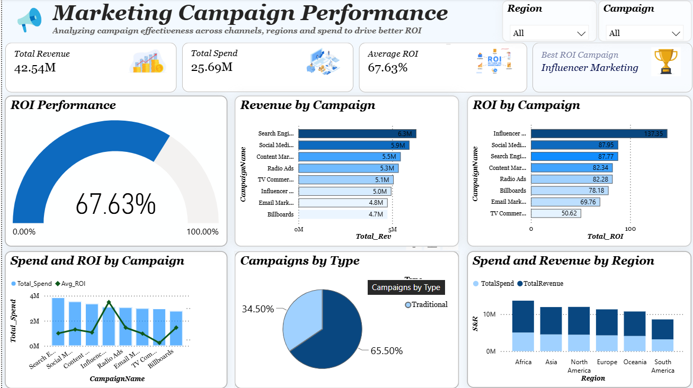

# 📊 Marketing Campaign Performance Analysis

## Business Problem

The objective of this project is to analyze marketing campaign performance across different campaigns and regions.

The analysis focuses on:

- Revenue generation
- Marketing spend
- ROI
- Campaign performance
- Regional performance
- Digital vs Traditional campaigns

---

## 🛠️ Tools & Technologies

- Power BI
- DAX
- SQL
- Excel
- Data Visualization
- Business Analysis

---

## 📌 Key KPIs

| KPI | Value |
|---|---:|
| Total Revenue | 42.54M |
| Total Marketing Spend | 25.69M |
| Overall ROI | 67.63% |

---

## 📈 Dashboard

---

## 🔍 Key Insights

### 1. Revenue Performance

Search Engine Ads generated the highest revenue among the campaigns analyzed.

### 2. Marketing Efficiency

Influencer Marketing produced the highest ROI in the dataset.

### 3. Campaign Mix

Digital campaigns account for 65.5% of campaign distribution.

### 4. Regional Analysis

Regional performance was evaluated using both marketing spend and revenue rather than revenue alone.

---

## 💡 Business Analysis

Campaign performance depends on the objective:

**Search Engine Ads leads in revenue, while Influencer Marketing leads in ROI.**

This demonstrates that the campaign generating the highest revenue is not necessarily the campaign with the highest return relative to its investment.

---

## 📊 Dashboard Features

- Interactive Region filter
- Campaign filter
- Revenue analysis by campaign
- ROI analysis by campaign
- Spend vs ROI analysis
- Campaign type distribution
- Regional Spend vs Revenue analysis

---

## 🎯 Skills Demonstrated

- Data Analysis
- Power BI Dashboard Development
- DAX
- KPI Development
- Business Analysis
- Data Visualization
- Marketing Analytics
- Insight Generation

---

## 👨‍💻 Author

**Harsh**

Data Analyst | SQL | Power BI | Python | Excel

GitHub: https://github.com/harsh12103
